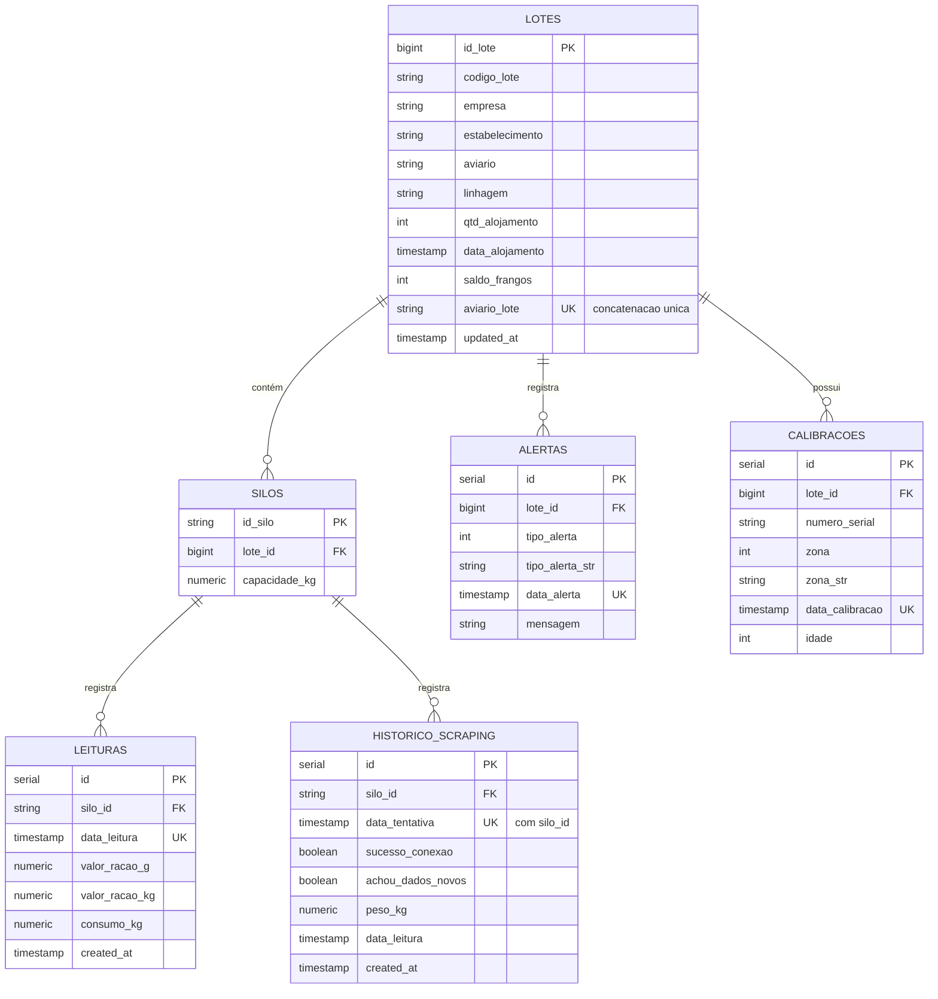

# Arquitetura e Decisões Técnicas

Este documento descreve as decisões de arquitetura, a stack de tecnologia, o modelo de banco de dados (MER) e as lições aprendidas ao longo do desenvolvimento do Agrisolus Scraper.

---

## 🏗️ Arquitetura do Sistema

A solução foi projetada de forma modular e baseada em Programação Orientada a Objetos (POO), facilitando a manutenção e a extensibilidade de cada componente.

### Fluxo de Dados e Fallback Offline
1. **Scraper (BeautifulSoup)**: Executado periodicamente via `cron` (a cada 1 hora).
2. **Persistência Principal**: Tenta inserir os dados coletados diretamente no **Supabase (PostgreSQL)** via SDK HTTP Client.
3. **Fallback Offline**: Se a conexão de rede falhar (comum em ambientes rurais/aviários), os dados são salvos localmente em um banco de dados **SQLite** (`local_fallback.db`).
4. **Sincronizador (`SyncService`)**: A cada execução bem-sucedida com internet, verifica se existem registros pendentes no SQLite e faz o upload incremental (upsert) para o Supabase, limpando os buffers locais.

---

## 🛠️ Stack Tecnológica

| Componente | Tecnologia | Racional de Escolha |
| :--- | :--- | :--- |
| **Ambiente de Execução** | Raspberry Pi 3B (Debian/Alpine Linux) | Baixo consumo de energia, ideal para ambiente físico (aviário), 1GB de RAM exige eficiência. |
| **Linguagem** | Python 3 | Excelente suporte para scraping, bancos de dados, gráficos e bots. |
| **Scraper** | BeautifulSoup4 / Requests | Leve e eficiente. Evitamos Selenium/Playwright devido ao limite de 1GB de RAM do Raspberry Pi. |
| **Banco Remoto** | Supabase (PostgreSQL) | Banco de dados relacional gratuito na nuvem, com ótima API RESTful. |
| **Banco Local** | SQLite | Serverless, sem consumo de RAM adicional, embutido no Python, ideal para fallback local. |
| **Telegram Bot** | aiogram (v3) | Serviço push-only leve executado via Cron periódico, eliminando uso contínuo de RAM (Option B). |
| **Dashboard** | Streamlit | Permite criar dashboards de dados dinâmicos de forma rápida e com ótima estética visual. |

---

## 📐 Modelo de Entidade e Relacionamento (MER)

O MER definitivo abaixo reflete de forma exata os campos disponíveis nos objetos coletados (`lotes`, `saldoRacao`, `alertas` e `calibracoes`). Ele garante compatibilidade estrutural tanto no Supabase quanto no SQLite local.

---

## 📝 Changelog

### v1.1.1 (2026-06-19)
- **Correção na Lógica de Dados Novos**: Atualização do processo de verificação `achou_dados_novos` para considerar tanto a unicidade de data quanto a alteração de peso físico do silo comparado com a última medição bem-sucedida, prevenindo falsos positivos causados pela limpeza periódica das tabelas locais do SQLite pós-sincronização.
- **Campo data_leitura no Histórico**: Adicionada a coluna `data_leitura` na tabela `historico_scraping` para validação robusta de unicidade.
- **Comissionamento Integrado**: Atualização do script de comissionamento para validar a inserção de silos e do histórico de scraping (incluindo `data_leitura`), servindo como ferramenta de diagnóstico imediata da estrutura física no Supabase.

### v1.1.0 (2026-06-18)
- **Cálculo do SLA Redesenhado**: Implementação de histórico de tentativas de scraping de hora em hora via tabela `historico_scraping`.
- **Tolerância a Falhas**: O histórico é salvo no SQLite local caso o Supabase esteja offline e sincronizado via `SyncService` no próximo ciclo online.
- **Limpeza de Arquivos (Docker)**: Remoção de todos os arquivos de containerização e orquestração Docker (`Dockerfile`, `docker-compose.yml`, `docker-crontab`), simplificando a infraestrutura para execução direta e nativa no Raspberry Pi / Alpine Linux através do ambiente virtual Python (`env/`).
- **Refatoração de Scripts**: Atualização de caminhos absolutos para caminhos relativos dinâmicos nos utilitários da pasta `scripts/`, prevenindo erros de coleta de testes com o Pytest.

### v1.0.0 (2026-06-18)
- Migração completa de todas as conexões diretas SQL para o SDK oficial do Supabase.
- Implementação de alertas imediatos, resumos periódicos e relatórios de SLA baseados em Cron (Option B).
- Criação do dashboard Streamlit interativo com suporte a fallback offline (SQLite).
- Criação de scripts de implantação sequencial (`scripts/deploy/`).
- Criação de suíte de testes com cobertura para scripts e dashboard (100% aprovada).

### v0.1.0 (2026-06-17)
- Inicialização do repositório Git.
- Configuração do `.gitignore` para proteção de credenciais (`.env`).
- Criação dos documentos `ROADMAP.md` e `COMPLETUDE.md` na raiz do projeto.
- Estruturação da pasta `knowledge/` com tutoriais e decisões arquiteturais.

---

## 💡 Lições Aprendidas
- *Alpine Linux vs Debian Slim no Docker*: Ao utilizar pacotes que requerem compilação C local (como `lxml` ou `cryptography`), o Debian Slim é preferível pois suporta downloads diretos de wheels pré-compiladas para arquiteturas ARM (Raspberry Pi), poupando tempo de build e evitando estouro de memória no Pi 3B.
- *Execução direta no host (Nativa)*: Rodar o projeto de forma direta no Alpine Linux via ambiente virtual (`venv`) consome substancialmente menos RAM e CPU do que virtualização por container (Docker) em hardware limitado como o Raspberry Pi 3B de 1GB.
- *Push-Only Notifier*: Evitar daemons de bot que escutam mensagens (polling/webhooks) economiza RAM preciosa no Raspberry Pi 3B e melhora a confiabilidade contra falhas do processo em background.
