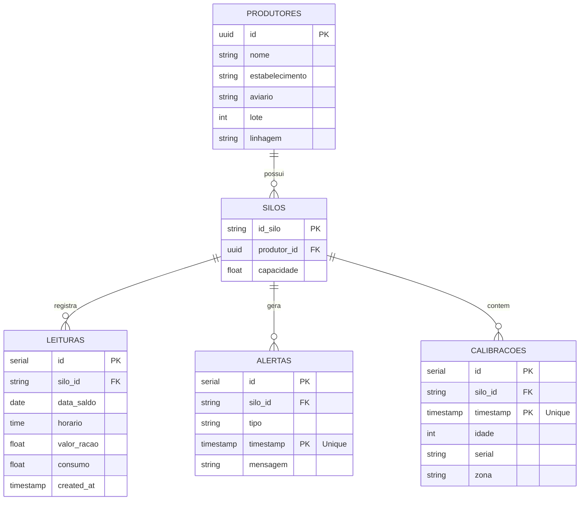

# Arquitetura e Decisões Técnicas

Este documento descreve as decisões de arquitetura, a stack de tecnologia, o modelo de banco de dados (MER) e as lições aprendidas ao longo do desenvolvimento do Agrisolus Scraper.

---

## 🏗️ Arquitetura do Sistema

A solução foi projetada de forma modular e baseada em Programação Orientada a Objetos (POO), facilitando a manutenção e a extensibilidade de cada componente.

### Fluxo de Dados e Fallback Offline
1. **Scraper (BeautifulSoup)**: Executado periodicamente via `cron` (a cada 1 hora).
2. **Persistência Principal**: Tenta inserir os dados coletados diretamente no **Supabase (PostgreSQL)**.
3. **Fallback Offline**: Se a conexão de rede falhar (comum em ambientes rurais/aviários), os dados são salvos localmente em um banco de dados **SQLite** (`local_fallback.db`).
4. **Sincronizador (`SyncService`)**: A cada execução bem-sucedida com internet, verifica se existem registros pendentes no SQLite e faz o upload incremental para o Supabase.

---

## 🛠️ Stack Tecnológica

| Componente | Tecnologia | Racional de Escolha |
| :--- | :--- | :--- |
| **Ambiente de Execução** | Raspberry Pi 3B (Alpine Linux) | Baixo consumo de energia, ideal para ambiente físico (aviário), 1GB de RAM exige eficiência. |
| **Linguagem** | Python 3 | Excelente suporte para scraping, IA, bancos de dados e bots. |
| **Scraper** | BeautifulSoup4 / Requests | Leve e eficiente. Evitamos Selenium/Playwright devido ao limite de 1GB de RAM do Raspberry Pi. |
| **Banco Remoto** | Supabase (PostgreSQL) | Banco de dados relacional gratuito na nuvem, com ótima API e dashboards internos. |
| **Banco Local** | SQLite | Serverless, sem consumo de RAM adicional, embutido no Python, ideal para fallback local. |
| **Telegram Bot** | aiogram (v3) | Assíncrono, robusto, ideal para rodar em segundo plano sem travar a CPU. |
| **Dashboard** | Streamlit | Permite criar dashboards de dados dinâmicos de forma rápida e com ótima estética visual. |

---

## 📐 Modelo de Entidade e Relacionamento (MER)

O MER abaixo é implementado tanto no Postgres do Supabase quanto replicado no SQLite local para garantir a compatibilidade estrutural.

---

## 📝 Changelog

### v0.1.0 (2026-06-17)
- Inicialização do repositório Git.
- Configuração do `.gitignore` para proteção de credenciais (`.env`).
- Criação dos documentos `ROADMAP.md` e `COMPLETUDE.md` na raiz do projeto.
- Estruturação da pasta `knowledge/` com tutoriais e decisões arquiteturais.

---

## 💡 Lições Aprendidas
- *Alpine Linux no Raspberry Pi 3B*: Como o Alpine usa `musl` em vez de `glibc`, bibliotecas que dependem de C pré-compiladas (como `psycopg2` ou `cryptography`) podem precisar ser instaladas via gerenciador de pacotes do sistema (`apk`) ou compiladas localmente. Recomenda-se utilizar `psycopg2-binary` para desenvolvimento inicial ou SQLAlchemy.
