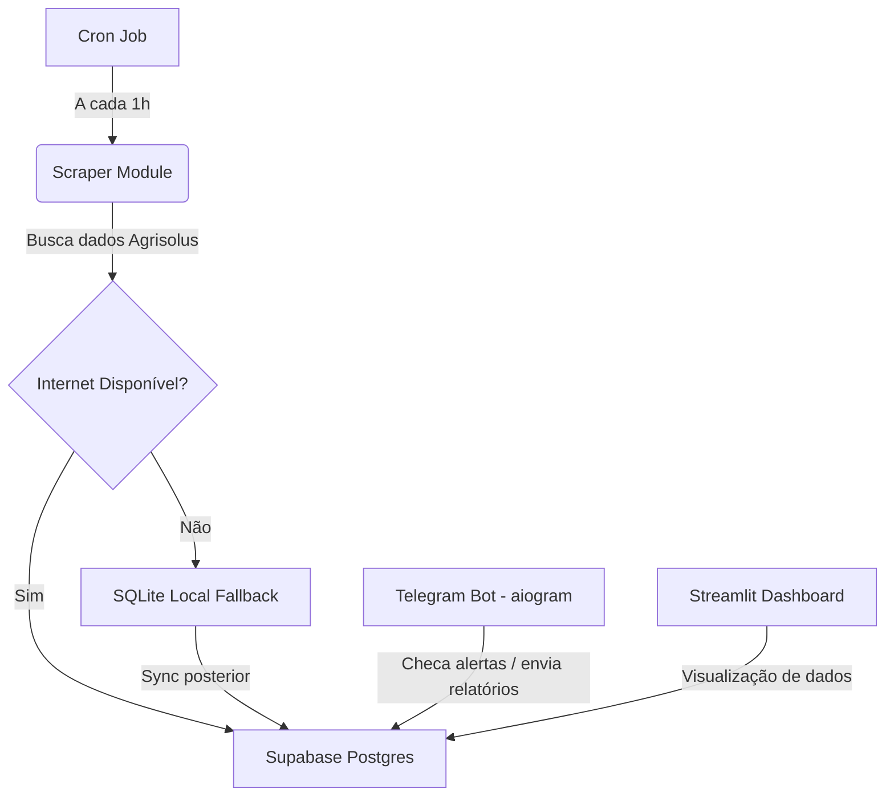

# Plano de Desenvolvimento - Agrisolus Scraper

Este plano detalha a implementação da solução para monitorar as células de carga (silos) de ração, com foco nos três pilares solicitados: **Comunicação Eficiente**, **Processos Otimizados** e **Tecnologia Habilitadora**.

---

## 🛠️ Arquitetura do System

A arquitetura do sistema foi projetada para rodar em um **Raspberry Pi 3B (Alpine Linux, 1GB RAM)**, o que exige eficiência no uso de memória e CPU.

---

## 📅 Roadmap de Desenvolvimento

### **Fase 1: Estruturação Inicial e Documentação**
- [x] Criar estrutura de pastas orientada a objetos (POO).
- [x] Criar arquivos `ROADMAP.md` e `COMPLETUDE.md` em `knowledge/`.
- [x] Criar `supabase_tutorial.md` e `architecture.md` em `knowledge/`.
- [x] Salvar `development_plan.md` em `knowledge/`.

### **Fase 2: Modelagem e Persistência de Dados**
- [ ] Configuração do **Supabase (PostgreSQL)**:
  - Criação do schema de tabelas: `produtores`, `silos`, `leituras`, `alertas` e `calibracoes`.
- [ ] Implementação do **SQLite local** para fallback (caso o aviário perca internet).
- [ ] Criação do serviço de sincronização (`SyncService`) para enviar dados salvos no SQLite para o Supabase quando a conexão for restabelecida.

### **Fase 3: Módulo Scraper (BeautifulSoup)**
- [ ] Criar gerador de arquivo JSON de configuração conforme `docs/GerarJson.md`.
- [ ] Implementar a classe `AgrisolusScraper` para realizar o login e scraping dos dados dos lotes e saldo de ração.
- [ ] Adicionar suporte a tratamento de erros e retentativas (resiliência).
- [ ] Configurar o agendador local (ex: via cron) para rodar o scraper a cada hora.

### **Fase 4: Sistema de Alertas e Notificações (Telegram Bot - aiogram)**
- [ ] Criar bot Telegram usando a biblioteca `aiogram`.
- [ ] **Lógica de Alerta**: Enviar mensagem imediatamente se o silo ficar mais de **2 horas** sem dados novos.
- [ ] **Resumo Periódico**: Enviar às **06:00, 11:00, 13:00 e 16:00** um resumo das últimas horas em que o silo ficou offline.
- [ ] **Relatório de SLA**: Enviar diariamente às **18:00** o SLA do silo (das 17:00 do dia anterior até as 17:00 do dia atual), contendo a curva de saldo de ração e o consumo do silo.

### **Fase 5: Dashboard Streamlit**
- [ ] Desenvolver interface visual no **Streamlit** para visualização:
  - Saldo em tempo real dos silos.
  - Curva de consumo diário.
  - Histórico de alertas e tempo de atividade (SLA).

### **Fase 6: Testes, Scripts e Docker**
- [ ] Criar testes unitários e de integração na pasta `/tests`.
- [ ] Desenvolver scripts em `/scripts` para:
  - Comissionamento (testar conexões de banco e credenciais).
  - Simulação de quedas de internet para testar o fallback SQLite.
- [ ] Criar `Dockerfile` e `docker-compose.yml` otimizados para o Raspberry Pi 3B (Alpine Linux).

---

## 📋 Modelo de Dados Sugerido (MER)

### 1. `produtores`
- `id` (UUID / Serial, PK)
- `nome` (Text, Not Null)
- `estabelecimento` (Text)
- `aviario` (Text, Not Null)
- `lote` (Integer)
- `linhagem` (Text)

### 2. `silos`
- `id_silo` (Text, PK) - Identificador do silo no Agrisolus
- `produtor_id` (FK produtores.id)
- `capacidade` (Numeric)

### 3. `leituras`
- `id` (Serial, PK)
- `silo_id` (FK silos.id_silo)
- `data_saldo` (Date, Not Null)
- `horario` (Time, Not Null)
- `valor_racao` (Numeric, Not Null)
- `consumo` (Numeric) - Calculado em relação à leitura anterior
- `created_at` (Timestamp, Default now())

### 4. `alertas`
- `id` (Serial, PK)
- `silo_id` (FK silos.id_silo)
- `tipo` (Text)
- `timestamp` (Timestamp, Unique, Not Null)
- `mensagem` (Text, Not Null)

### 5. `calibracoes`
- `id` (Serial, PK)
- `silo_id` (FK silos.id_silo)
- `timestamp` (Timestamp, Unique, Not Null)
- `idade` (Integer)
- `serial` (Text)
- `zona` (Text)
